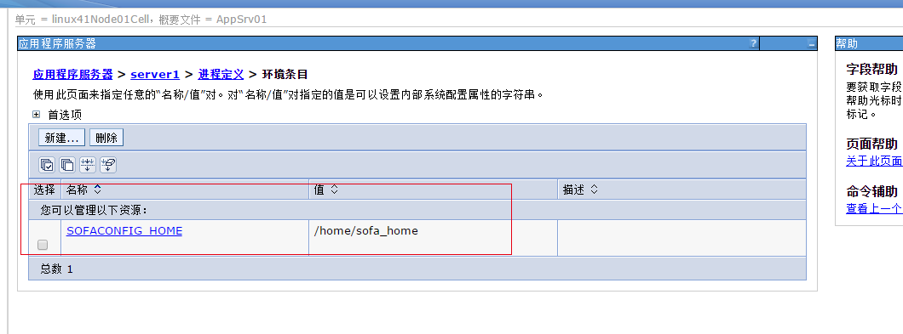

# 新一代托管系统_websphere单机部署手册
## 1. websphere安装

安装所需要的软件包:

InstalMgr1.6.2_LNX_X86_64_WAS_8.5.5.zip

WAS_ND_V8.5_1_OF_3.zip

WAS_ND_V8.5_2_OF_3.zip

WAS_ND_V8.5_3_OF_3.zip

把安装的软件包放到/home/was8.5/installer路径

输入命令:unzip InstalMgr1.6.2_LNX_X86_64_WAS_8.5.5.zip 

解压 InstalMgr1.6.2_LNX_X86_64_WAS_8.5.5.zip 包

执行安装程序：

输入命令进入路径：cd /home/was8.5/installer

输入命令：./install     （./consoleinst.sh）

## 2、创建部署包目录
### 2.1 创建容器存放文件夹
在管理集群应用服务器文件目录中创建一个存放war包的文件夹，如创建名叫sofa文件夹（创建的文件夹有读写及执行等权限），将sofa**.war上传到sofa文件目录下:

并执行解压命令：
jar –xvf sofa**.war

解压后相应目录中有web-inf及meta-inf两个文件。如图:

解压war包：jar –xvf sofa**.war

打war包：  jar -cvf acs.war ./*     
### 2.2 存放sofa_home目录
把sofa_home文件夹上传到/home下

## 3、参数配置

### 3.1 启动websphere控制台

进入目录：/opt/IBM/WebSphere/AppServer/profiles/AppSrv01/bin 

输入命令：./startServer.sh server1 

启动控制台 
server1为应用程序服务器名称

### 3.2 登录websphere控制台
输入http://IP:端口号/ibm/console登录WebSphere控制台

例：http://192.168.103.92:9060/ibm/console
Websphere默认端口9060，Weblogic端口自己创建。

### 3.3 配置JVM参数

点击服务器-服务器类型-WebSphere Application Server 

点击server1

点击进程定义

点击java虚拟机，输入初始堆大小、最大堆大小，点击保存。

### 3.4 sofa_home环境条目

进入应用程序服务器 > server1 > 进程定义 ，点击环境条目。

点击新建按钮，进入环境条目设置界面

输入名称SOFACONFIG_HOME，值/home/sofa_home（sofa_home路径），点击确定按钮

### 3.5字符集的修改

应用程序服务器》server名称》进程定义》Java虚拟机》定制属性：

新增属性：file.encoding=UTF-8

## 4、部署应用服务

进入webshpere管理控制台，应用程序》webshpere企业应用程序》

点击安装按钮，选择部署包：

点击下一步：

点击下一步：需选择安装应用程序的目录：

点击下一步：

点击下一步，设置上下文跟路径（注意需要以“/”开头）：
系统访问地址跟这个上下文根路径有关。

点击下一步，点击完成。

## 5、升级JDK

Was中的jdk是自带的
路径：/home/IBM/WebSphere/AppServer/java

增加新JDK配置文件:
路径：
/home/IBM/WebSphere/AppServer/properties/sdk

由于该版本是was8.5.5.14,会自动升级jdk1.8

现在想要jdk1.6，改如何配置

cp 1.8_64_bundled.properties  1.6_64.properties 

vi 1.6_64.properties

内容如下：

com.ibm.websphere.sdk.version.1.6_64=1.6

com.ibm.websphere.sdk.bits.1.6_64=64

com.ibm.websphere.sdk.location.1.6_64=$
{WAS_INSTALL_ROOT}/java1.6

com.ibm.websphere.sdk.platform.1.6_64=linux

com.ibm.websphere.sdk.architecture.1.6_64=x86_64

com.ibm.websphere.sdk.nativeLibPath.1.6_64=${WAS_INSTALL_ROOT}/lib/native/linux/x86_64/

登陆was控制台就可以看到多了一个jdk1.6的配置，可以选择指定的jdk版本作为缺省值。

注意：原was（was8.5.5.0）自带jdk1.6的只能直接升级到8.5.5.13，升级到8.5.5.13之后jdk自动升级为1.8版本了

was补丁下载地址：
http://www-01.ibm.com/support/docview.wss?rs=180&context=SSEQTP&uid=swg27004980#ver85_0

## 6、删除概要文件

[root@localhost ProfileManagement]# cd /home/IBM/WebSphere/AppServer/bin/

[root@localhost bin]# ./manageprofiles.sh -listProfiles

[root@localhost bin]# ./manageprofiles.sh -delete -profileName AppSrv02