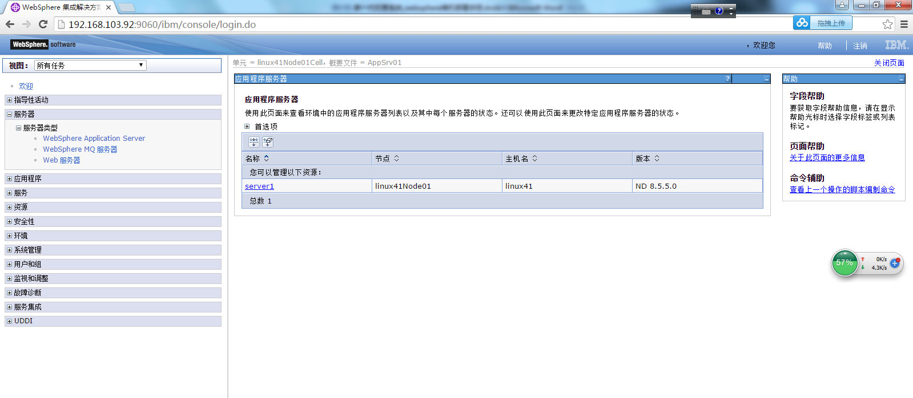

# 新一代托管系统_websphere单机部署手册
## 1. was工作台安装

安装所需要的软件包:

InstalMgr1.6.2_LNX_X86_64_WAS_8.5.5.zip

WAS_ND_V8.5_1_OF_3.zip

WAS_ND_V8.5_2_OF_3.zip

WAS_ND_V8.5_3_OF_3.zip

安装Install_Mgr_v1.6.2_Lnx_WASv8.5.5.zip

把InstalMgr1.6.2_LNX_X86_64_WAS_8.5.5.zip软件包放到/home/was8.5/installer路径

```
[root@localhost was8.5]# unzip Install_Mgr_v1.6.2_Lnx_WASv8.5.5.zip
```


执行安装程序：

输入命令进入路径：cd /home/was8.5/installer

* 输入命令：./install     （./consoleinst.sh）下一步：


* 下一步：


* 输入安装路径，下一步：


* 安装：


* 安装完成，重新启动Installation Manager


## 2. was安装

* 解压was安装包

```
[root@localhost WAS]# unzip "*.zip"
```


* 安装was

切换到eclipse目录，执行安装命令：
```
[root@localhost WAS]# cd /home/IBM/InstallationManager/eclipse/

[root@localhost eclipse]# ./IBMIM
```

点击文件，选择首选项：


* 添加存储库，存储库文件在解压的was安装包目录，确定。


* 点击安装


* 下一步


* 下一步


* 下一步


* 指定安装目录，下一步


* 下一步


* 安装


## 3. 创建was概要文件

切换到创建概要文件目录：
```
[root@localhost eclipse]# cd /home/IBM/WebSphere/AppServer/bin/ProfileManagement/
```
执行：
```
[root@localhost ProfileManagement]# ./wct.sh
```

点击创建：


下一步：


点击完成：


点击安装验证：


安装概要文件完成：


打开控制台：


## 4、创建部署包目录
### 4.1 创建容器存放文件夹
在管理集群应用服务器文件目录中创建一个存放war包的文件夹，如创建名叫sofa文件夹（创建的文件夹有读写及执行等权限），将sofa**.war上传到sofa文件目录下:


并执行解压命令：
jar –xvf sofa**.war


解压后相应目录中有web-inf及meta-inf两个文件。如图:


解压war包：jar –xvf sofa**.war

打war包：  jar -cvf acs.war ./*     
### 4.2 存放sofa_home目录
把sofa_home文件夹上传到/home下


## 5、参数配置

### 5.1 启动websphere控制台

进入目录：/opt/IBM/WebSphere/AppServer/profiles/AppSrv01/bin 

输入命令：./startServer.sh server1 

启动控制台 
server1为应用程序服务器名称

### 5.2 登录websphere控制台
输入http://IP:端口号/ibm/console登录WebSphere控制台

例：http://192.168.103.92:9060/ibm/console
Websphere默认端口9060，Weblogic端口自己创建。


### 5.3 配置JVM参数

点击服务器-服务器类型-WebSphere Application Server 



点击server1


点击进程定义


点击java虚拟机，输入初始堆大小、最大堆大小，点击保存。

### 5.4 sofa_home环境条目

进入应用程序服务器 > server1 > 进程定义 ，点击环境条目。


点击新建按钮，进入环境条目设置界面


输入名称SOFACONFIG_HOME，值/home/sofa_home（sofa_home路径），点击确定按钮


### 5.5字符集的修改

应用程序服务器》server名称》进程定义》Java虚拟机》定制属性：

新增属性：file.encoding=UTF-8


## 6、部署应用服务

进入webshpere管理控制台，应用程序》webshpere企业应用程序》


点击安装按钮，选择部署包：


点击下一步：


点击下一步：需选择安装应用程序的目录：


点击下一步：


点击下一步，设置上下文跟路径（注意需要以“/”开头）：
系统访问地址跟这个上下文根路径有关。


点击下一步，点击完成。


## 7、升级JDK

### 7.1 Was中的jdk是自带的
路径：/home/IBM/WebSphere/AppServer/java


### 7.2 下载jdk1.8的安装包。利用repository.xml安装。

如果直接用sun的jdk，业务系统会启动失败。

### 7.3 其他
cd /home/IBM/WebSphere/AppServer/bin

// 列出当前可用SDK

./managesdk.sh -listAvailable

// 查询新概要文件创建是用的哪个版本的SDK
./managesdk.sh -getNewProfileDefault

// 设置新概要文件创建SDK  [用1.6的jdk创建]
./managesdk.sh -setNewProfileDefault -sdkName 1.6_64

// 设置新概要文件创建SDK  [用1.8的jdk创建]
./managesdk.sh -setNewProfileDefault -sdkName 1.8_64


//列出所有概要文件所使用的sdk
[root@localhost bin]# ./managesdk.sh -listEnabledProfileAll

### 7.4 注意

原was（was8.5.5.0）自带jdk1.6的只能直接升级到8.5.5.13，升级到8.5.5.13之后jdk还是原有的jdk1.6,需要重新安装was支持的jdk1.8

8.5.5.0升级到8.5.5.14才会直接把jdk升级到1.8。

was补丁下载地址：
http://www-01.ibm.com/support/docview.wss?rs=180&context=SSEQTP&uid=swg27004980#ver85_0

## 8、删除概要文件

[root@localhost ProfileManagement]# cd /home/IBM/WebSphere/AppServer/bin/

[root@localhost bin]# ./manageprofiles.sh -listProfiles

[root@localhost bin]# ./manageprofiles.sh -delete -profileName AppSrv02