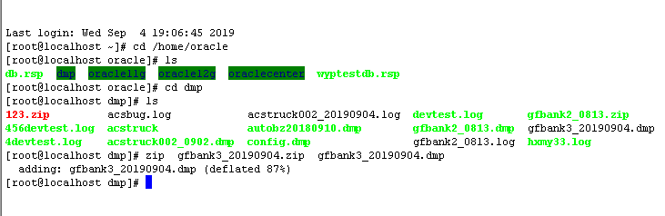

# DMP导出篇

## 1登录系统

登录linux系统上的oracle数据库，默认数据泵导出的文件是放在/home/oracle/dmp下面。

## 2切换oracle用户环境变量

用root登录oracle数据库所在的linux系统,执行下面语句：
```
cd /home/oracle/
source  .bash_profile   --用户变量
su oracle   --切换到oracle用户
```

## 3输入导出语句并执行

 expdp 当前数据库的用户名/密码@实例名 schemas=用户名 dumpfile=即将导出的文件名_.dmp  directory=导出路径在oracle中指向的目录名 logfile=用户名_日期.log

 备注：directory=dump_dir  导出路径在oracle中指向的目录名，linux中默认设置的路径为/home/oracle/dmp，到这路径找dmp文件即可。


举例：
```
expdp gfbank3/gfbank3@orcl schemas=gfbank3 dumpfile=gfbank3_20190904.dmp directory=dump_dir logfile=acstruck002_20190904.log
```

## 4压缩DMP下载到本地

压缩dmp文件后再上传到SVN
压缩命令（zip为例）：
```
zip 文件名.zip 文件名.dmp
```
示例：
``` 
zip  gfbank3_20190904.zip  gfbank3_20190904.dmp
```



压缩完成，linux操作页面会提示压缩率，如示例中87%是压缩率，比方100M，压缩后只有13M：adding: gfbank3_20190904.dmp (deflated 87%)