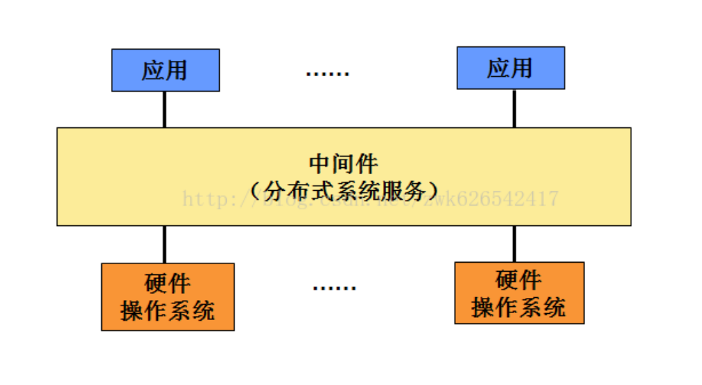
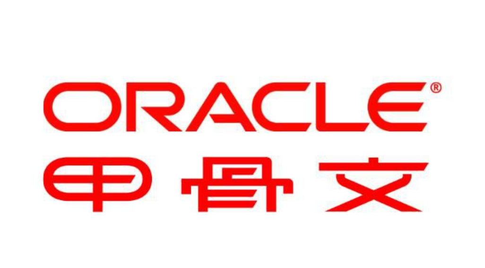
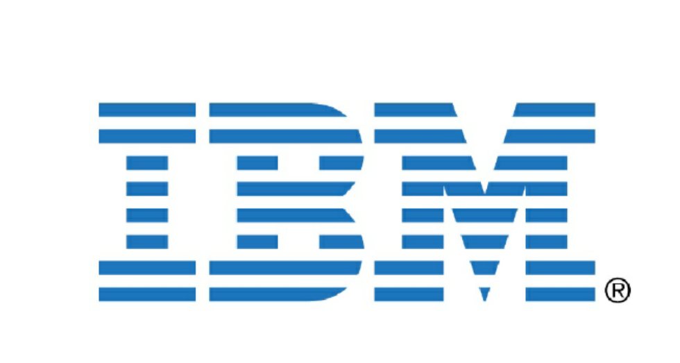

## 1. 中间件概念
中间件在操作系统、网络和数据库之上， 应用软件的下层，总的作用是为处于自己上层的应用软件提供运行与开发的环境，帮助用户灵活、高效地开发和集成复杂的应用软件。

## 2. 主流中间件类型

### 2.1 Tomcat 
用途：小项目，或者是个人开发。

开发公司：sun公司（java发明者），已被甲骨文公司收购

### 2.2 Weblogic 
用途：大项目或者商业项目

开发公司：BEA公司，著名的Java中间件软件公司，已被甲骨文公司收购。

### 2.3 Websphere  
用途：大项目或者商业项目

开发公司：IBM

### 2.4 Jboss
用途：小项目，示例项目。

开发公司：Red Hat（红帽公司），已被IBM收购。

