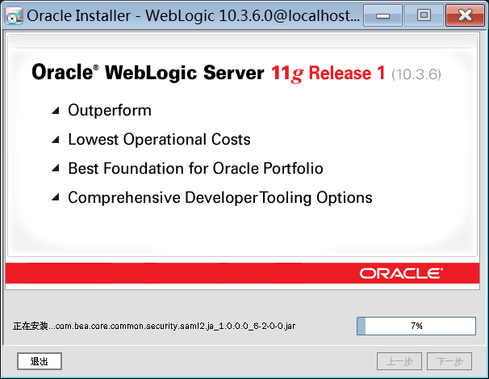

# 新一代托管系统_weblogic单机部署手册

## 1. 安装weblogic
* 下载weblogic安装包


* 执行安装（前提系统已安装jdk）

```
[root@localhost sofaware]# java -jar wls1036_generic.jar
```


* 下一步，根据需要选择安装目录。


* 去除邮件通知，点击确定并下一步


* 继续


* 下一步


* 下一步


* 下一步


* 下一步


* 下一步


* 安装中



* 安装完成，点击完成


## 2. 安装weblogic域

* 切换至域安装目录

```
[root@localhost sofaware]# cd /home/Oracle/Middleware/wlserver_10.3/common/bin/
```
* 执行安装命令

```
[root@localhost bin]# ./config.sh
```


* 下一步


* 指定域名，和域安装路径，下一步。


* 输入weblogci登录用户名和密码，下一步。


* 选择“生产模式”和对应的jdk，下一步。


* 选择“管理服务器”，下一步。


* 输入名称，端口号，下一步。


* 点击创建


* 域创建成功，点击完成。


## 3. 配置域文件参数

* 切换到域的安装目录下的bin目录：
```
/home/Oracle/Middleware/user_projects/domains/base_domain7001/bin/
```

### 3.1编辑startWebLogic.sh文件

```
[root@localhost bin]# vi startWebLogic.sh
```
添加前面创建的用户信息，保存。

```
export WLS_USER=weblogic
export WLS_PW=123456789
```


### 3.2编辑setDomainEnv.sh文件

```
[root@localhost bin]# vi setDomainEnv.sh 
```

配置堆栈参数：

```
export JAVA_OPTIONS="${JAVA_OPTIONS}
-Xdebug -Xnoagent -Djava.compiler=NONE -Xrunjdwp:transport=dt_socket,server=y,suspend=n,address=8787
-Xms4096m -Xmx4096m -Xmn1024m -XX:PermSize=1024m -XX:MaxPermSize=1024m
-XX:+HeapDumpOnOutOfMemoryError
-XX:+UseConcMarkSweepGC
-Doracle.jdbc.maxCacheBufferSize=0
-Dcom.sun.management.jmxremote.port=1099
-Dcom.sun.management.jmxremote.ssl=false
-Dcom.sun.management.jmxremote.authenticate=false
-Djavax.management.builder.initial=weblogic.management.jmx.mbeanserver.WLSMBeanServerBuilder
-Djava.awt.headless=true
-Dfile.encoding=gbk
-XX:+CMSPermGenSweepingEnabled
-XX:+CMSClassUnloadingEnabled
-XX:+ClassUnloading
-XX:-TraceClassResolution
-XX:-TraceClassUnloading
-XX:+HeapDumpOnOutOfMemoryError
-Djava.awt.headless=true
-Djava.rmi.server.hostname=192.168.7.171"
```
注意修改对应的IP和端口信息：如下

主机IP：

<font color=red size=3>-Djava.rmi.server.hostname=192.168.7.171"</font>

JVM监控端口：

<font color=red size=3>-Dcom.sun.management.jmxremote.port=1099</font>

JAVA调试端口：

<font color=red size=3>address=8787</font>

JVM参数：

<font color=red size=3>-Xms4096m -Xmx4096m -Xmn1024m -XX:PermSize=1024m -XX:MaxPermSize=1024m
</font>

```
-Xms ：为jvm启动时分配的内存

-Xmx：为jvm运行过程中分配的最大内存，超出了这个设置值，就会抛出OutOfMemory异常。

-Xmn：年轻代大小

-Xss：为jvm启动的每个线程分配的内存大小。

-XX:PermSize：表示非堆区初始内存分配大小

-XX:MaxPermSize：表示对非堆区分配的内存的最大上限。

整个堆大小=年轻代大小 + 年老代大小 + 持久代大小

年轻代：所有新生成的对象首先都是放在年轻代的

年老代：在年轻代中经历了N次垃圾回收后仍然存活的对象，就会被放到年老代中。因此，可以认为年老代中存放的都是一些生命周期较长的对象。

永久代：用于存放静态文件，如今Java类、方法，永久代对垃圾回收没有显著影响。永久代大小通过-XX:MaxPermSize进行设置
```


### 3.3启动

* 切换到域目录下的bin目录：启动
```
[root@localhost bin]# nohup ./startWebLogic.sh &
```
* 可用如下命令查看日志信息：
```
tail -f nohup.out
```


* 打开控制台：输入用户密码登录


## 4. 安装测试系统

### 4.1部署托管系统

* 在服务器放置好acs代码和sofa_home配置目录


* 登录控制台：进入部署页，点击安装。


* 选择存放路径，勾选acs目录，下一步：


* 下一步：


* 下一步：


* 点击完成


* 部署成功


* 为所有请求提供服务


* 点击是


* 能正常打开控制台，代表系统部署成功。


### 4.2配置文件修改 （sofa_home/global/）

* datasources.xml配置数据源
* parameters.ini配置sofa参数


## 5.卸载weblogic
* 切换到卸载目录
```
cd /home/Oracle/Middleware/wlserver_10.3/uninstall/
```


* 执行卸载
```
./uninstall.sh
```


* 下一步，


* 提示卸载完成，点击完成。


